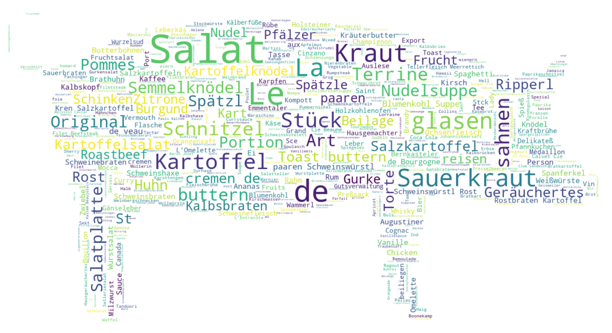

# Schmankerl Time Machine
Das Projekt ist im Rahmen des Kultur-Hackathons für offene Kulturdaten - [Coding da Vinci Süd 2019](https://codingdavinci.de/events/sued/) - entstanden. 

## Projekt

> Kommt bei Ihnen zu Hause immer nur das Gleiche auf den Tisch? Sind Sie auf der Suche nach kulinarischer Vielfalt in Ihrem Alltag? Noch ist nicht Hopfen und Malz verloren!  
> Die "Schmankerl Time Machine" lädt Sie zu einem lukullischen Streifzug durch die traditionsreiche Münchner Wirtshausgeschichte der vergangenen 150 Jahre ein. Verschaffen Sie sich einen Überblick über die Legenden am Münchner Gastrohimmel, über verglühte Sterne und nie verblühende Evergreens. Stellen Sie sich aus einem Portfolio von über 380 Speisekarten und den damit verlinkten Rezepturen Ihr unvergessliches Menü von Morgen zusammen. Wie wäre es mit einem Hummercocktail, gefolgt vom Hasen in der Terrine und Rehnüsschen, Fürst Pückler als krönendem Abschluss? Lassen Sie sich bei Ihrer Menükreation von den Vorschlägen anderer Nutzer inspirieren. Laden Sie die Speisekarte Ihres favorisierten Münchner Genusstempels hoch, um das Angebot noch zu erweitern.
>   Let’s Schmankerl!

### Daten
Ein Snapshot der extrahierten Daten kann in dem Ordner [Daten](Daten/) gefunden werden.
* **addresses** Extrahierte Adressen, die in den Speisekarten annotiert wurden
* **categories** Speisekarten-Kategorien (Vorspeisen, Hauptgerichte, ...)
* **entries** Verknüfung von Speisen/Getränken zu Speisekarten, inkl. Preis und Mengenangaben
* **items** Beschreibung der Speisen/Getränke
* **menus** Metadaten zu den Speisekarten
* **owners** Restaurant-Inhaber, die in den Speisekarten annotiert wurden
* **recipies** Verknüpfung von Speisen/Getränken zu Chefkoch (Verfügbar unter https://chefkoch.de/rezepte/{recipy_id}/)
* **restaurants** Meta-Informationen zu den Restaurants
* **zones** Einträge auf Speisekarten und deren Koordinaten (Bounding Boxes)

### Realisierung
#### JupyterNotebooks
Im Ordner [Notebooks](Notebooks/) befinden sich einige Beispiel Notebooks zur Auswertung.

## Skripte
### Extrahieren der Daten aus der TEI Datei
Für das Extrahieren der Daten aus der aus Transkribus extportierten TEI Datei (Koordinaten in Form von Bounding Boxes) liegt das folgende Python basierte Skript bereit. Es erzeugt CSV-Dateien für die einzelnen Speisen, Einträge auf Karten, Besitzer, Adressen etc. 

	# python >= 3.6
    pip install --user -r requirements.txt
    python3 extract.py TEI.xml

## Werkzeuge

* [Transkribus](https://transkribus.eu/Transkribus/) - OCR-Erfassung der Speisekarten sowie Werkzeug für die Annotation
* [RStudio Shiny-Server](https://www.rstudio.com/products/shiny/shiny-server) - Plattform für die Web-Anwendung
* Python / JupyterNotebooks
* [Leaflet.js](https://leafletjs.com/) - JavaScript-Bibliothek für die interaktive Karte

## Forschungsdatenmanagement: Zitation und Nachnutzung

Sämtliche Abbildungen der Speisekarten sowie die im Projekt entstandenen Daten werden im Forschungsdatenrepositorium der LMU München (OpenData LMU) dauerhaft und mittels einer DOI eindeutig referenzierbar abgelegt: https://doi.org/10.5282/ubm/data.146
 Für die Zitation des Projekts oder Teilen daraus, empfehlen wir Ihnen folgende Angabe:
> Cakir, Osman/Kohl, Linus/Multerer, Clara/Reisser, Alexandra/Schneider, Stefanie/Schulz, Julian: Schmankerl Time Machine: Eine kulinarische Zeitreise durch die Speisekarten traditionsreicher Münchner Gaststätten. 18. Mai 2019. Open Data LMU: https://doi.org/10.5282/ubm/data.146.

Eine Spezifikation der Daten im Metadatenschema [DataCite 4.2](https://schema.datacite.org/meta/kernel-4/) steht zur Nachnutzung bereit: [Codav DataCite](https://gitlab.com/cds19-team/cds19/blob/86a2b0944fa97049f0e887430688947279fe663c/codav_datacite.xml) 
Die Spezifikation folgt der DataCite Best-Practice-Policy, die derzeit im Rahmen des Projekts [eHumanities - interdisziplinär](https://www.fdm-bayern.org/) ausgearbeitet wird.

## Mitwirken

Wir freuen uns über Ihre Unterstützung bei der Annotation weiterer Speisekarten mit Transkribus. Hierfür haben wir ein [Crowdsourcing Projekt](https://transkribus.eu/r/read/projects/) angelegt. Beiträge in Form von Programmen oder Verbesserungen sind sehr willkommen, öffnen Sie in diesem Fall bitte einen Pull-Request. 

## TEAM
* **Julian Schulz** - [Website](https://www.hgw.geschichte.uni-muenchen.de/personen/mitarbeiter/schulz), [ORCID](https://orcid.org/0000-0003-4374-2680), [Twitter](https://twitter.com/SchJulzian)
* **Linus Kohl** - [Website](https://munichresearch.com), [ORCID](https://orcid.org/000-0003-3400-837X), [LinkedIn](https://www.linkedin.com/in/linuskohl), [Twitter](https://twitter.com/LinusKohl)
* **Stefanie Schneider** - [Website](https://www.kunstgeschichte.uni-muenchen.de/personen/wiss_ma/schneider/index.html), [ORCID](https://orcid.org/0000-0003-4915-6949), [Twitter](https://twitter.com/_stschneider)
* **Alexandra Reisser** - [ORCID](https://orcid.org/0000-0001-5560-1901), [LinkedIn](https://www.linkedin.com/in/alexandra-rei%C3%9Fer-379aa7180/), [Twitter](https://twitter.com/alexreisser)
* **Osman Cakir** - [Website](https://osmancakir.io/), [ORCID](https://orcid.org/0000-0002-4828-0748), [Twitter](https://twitter.com/osmancakirio)
Eine erweiterte Liste der Beitragenden zu diesem Projekt finden Sie unter [Beitragende](XX).

## Lizenzen
* Abbildungen der Speisekarten wurden unter der Lizenz [CC BY-SA 4.0](https://creativecommons.org/licenses/by-sa/4.0) von der Münchner Stadtbibliothek / Monacensia im Hildebrandhaus bereitgestellt.
* Daten, die im Rahmen des Projektes entstanden sind, unterliegen ebenfalls der Lizenz [CC BY-SA 4.0](https://creativecommons.org/licenses/by-sa/4.0).
* Quelltext unterliegt der [GNU GPL v3](https://www.gnu.org/licenses/gpl-3.0.de.html) Lizenz.

## Danksagung
Wir bedanken uns sehr herzlich bei den Organisatoren des diesjähigen Wettbewerbs und der Projektkoordination von [Coding Da Vinci](https://codingdavinci.de/about/index-de.html)!

